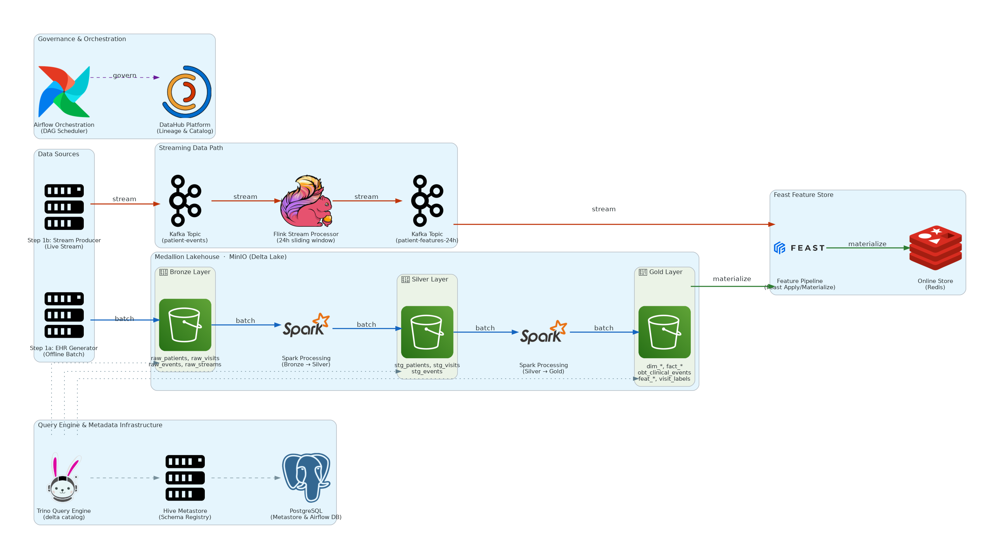

# Data Pipeline for Electronic Health Records

> A production-grade **Medallion Data Lakehouse** with a **Real-Time ML Feature Store**, built entirely on synthetic Electronic Health Records (EHR). The system ingests raw clinical data from both batch (Parquet files) and stream (Kafka) sources, applies a three-layer medallion transformation (Bronze → Silver → Gold) using Apache Spark and PyFlink, and materialises ML-ready patient features into an offline (Trino/Delta Lake) and online (Redis) Feast feature store. Metadata governance is handled end-to-end by DataHub, with pipeline orchestration via Apache Airflow. The dataset represents ~1,000 synthetic patients across 5 clinical event types (vitals, labs, medications, diagnoses, ward events), covering admissions, discharges, and longitudinal clinical measurements.
>
> All services run **rootless** via **Podman** (no Docker daemon, no root required) using `network_mode: host` and **uv** as package manager.

---

See [./docs](docs) for detailed documentations of the project. 
<!-- This is my submission for [FSDS course](https://fullstackdatascience.com/) K9-EDAI-1. -->

## Architecture

<!-- ```
┌─────────────────────────────── DATA SOURCES ──────────────────────────────────┐
│  1a. EHR Generator → patients / wards / visits / events (Parquet)             │
│  1b. Stream Producer → infinite loop → Kafka: patient-events                  │
└──────────────────────────┬────────────────────────────────────────────────────┘
                           │
┌──────────────────────────┴────────────────────────────────────────┐
          │ BATCH PATH                      │     STREAMING PATH    │
          │                                 │                       │
          ▼                                 ▼                       │
  2a. Bronze Ingest               6_flink_stream_processor          │
  (Pandas → Delta Lake)           ┌──────────────────────────┐      │
  raw_patients                    │  Reads Kafka Topics      │      │
  raw_wards                       │       Infinitely         │      │
  raw_event_metadata              │                          │      │
  raw_visits                      │                          │      │
  raw_events                      │                          │      │
          │                       │                          │      │
          │                       │  Sink : SLIDE(24h/15m)   │      │
          ▼                       │  → patient-features-24h  │      │
  3. Silver Transform             │    (Kafka)               │      │
  (PySpark)                       └────────────┬─────────────┘      │
  stg_patients                                 │                    │
  stg_wards                                    ▼                    │
  stg_event_metadata               7_feature_pipeline               │
  stg_visits                       feast apply + materialize        │
  stg_events                       + Kafka → Feast push             │
          │                        → Online Store (Redis)           │
          ▼                                    │                    │
  4. Gold Transform                            ▼                    │
  (PySpark)                          ┌──────────────────┐           │
  dim_* / fact_* / obt_*             │  Feast           │           │
          │                          │  Online Store    │           │
          ▼                          │  (Redis)         │           │
  5. Feature Engineering             └──────────────────┘           │
  (PySpark)                                                         │
  feat_patient_vitals_6m                                            │
  feat_patient_labs_6m                                              │
  feat_patient_icd_6m                                               │
  feat_patient_medication_6m                                        │
  feat_patient_demographics                                         │
  gold_visit_labels (training labels)                               │
          │                                                         │
          ▼                                                         │
  Feast Apply + Materialize                                         │
  (Offline → Online Store)                                          │
└─────────────────────────────────────────────────────────────────-─┘

Metadata Governance: DataHub (lineage + catalogue)
Orchestration:       Apache Airflow (2 DAGs: ehr_data_pipeline + datahub_metadata_ingestion)
``` -->



See [`docs/`](docs/) for detailed layer designs, schemas, and feature store documentation.
See [`docs/00_installation.md`](docs/00_installation.md) for full installation and setup instructions.

---

## Technology Stack

| Component | Technology | Version | Role |
|---|---|---|---|
| **Batch Compute** | Apache Spark (PySpark) | 3.5.6 | Bronze→Silver→Gold transformations, feature engineering |
| **Stream Compute** | Apache Flink (PyFlink) | 2.2.0 | 24h sliding window features + raw stream archival |
| **SQL Query Engine** | Trino | 480 | Ad-hoc queries across Delta Lake; Feast offline store |
| **Table Format** | Delta Lake | 3.3.0 | ACID-compliant storage for all lakehouse layers |
| **Object Storage** | MinIO | latest | S3-compatible store for all Delta files |
| **Metastore** | Hive Metastore | 3.1.2 | Catalog for Trino → Delta mapping |
| **Message Broker** | Apache Kafka (KRaft) | latest | Real-time event streaming, no ZooKeeper |
| **Feature Store** | Feast | latest | Offline (Trino/Delta) + Online (Redis) feature serving |
| **Relational DB** | PostgreSQL | 15 | Airflow backend + Hive metastore backend |
| **Cache / Online Store** | Redis | 7 | Feast online feature serving |
| **Metadata Platform** | DataHub | v1.5.0.6 | Data catalogue, lineage, governance |
| **Orchestration** | Apache Airflow | 2.10.2 | DAG scheduling for batch + streaming pipeline |
| **Container Runtime** | Podman (rootless) | latest | All services run without root, no daemon required |
| **Package Manager** | uv | latest | Python environment and script runner |

---

## Run Guide

> See [`docs/00_installation.md`](docs/00_installation.md) for Podman installation, JAR download, and image build instructions.

### 0. Prerequisites

```bash
cp .env.example .env            # configure environment
make check-ports                # verify no port conflicts
make build-airflow              # build custom Airflow image (first time only)
make build-spark                # build custom Spark image (first time only)
```

### 1. Generate data

```bash
make generate       # generate synthetic Parquet + stream JSON
```

### 2. Start infrastructure

```bash
make up            # core stack: Kafka, Spark, Flink, Trino, MinIO, Postgres, Redis
make datahub-up    # DataHub (auto-runs ingestion + metadata enrichment)
make airflow-up    # Airflow webserver + scheduler
```

**Verify all containers are running:**

```bash
make ps
```

### 3. Batch pipeline (run in order)

```bash
make ingest         # Bronze: ingest Parquet → Delta Lake
make transform      # Silver: clean, deduplicate, normalise
make golden         # Gold: dims, facts, OBT
make features       # Feature tables + training labels
```

### 4. Streaming (each in a separate terminal)

```bash
make stream            # publish events → Kafka: patient-events
make flink-stream      # Flink: Bronze archival + 24h sliding window → Kafka: patient-features-24h
make feature-pipeline  # Feast apply + materialize + continuous Kafka → Redis push
```

### 5. Validate

```bash
make query-lakehouse      # validate all Bronze / Silver / Gold tables in Trino
make query-featurestore   # test online feature retrieval from Feast
```

### UI Consoles

| UI | URL | Credentials |
|---|---|---|
| **Airflow** | http://localhost:8082 | `airflow` / `airflow` |
| **DataHub** | http://localhost:9002 | `datahub` / `datahub` |
| **Trino** | http://localhost:8090 | — |
| **MinIO Console** | http://localhost:9001 | `minioadmin` / `minioadmin` |
| **Flink Dashboard** | http://localhost:8087 | — |
| **Spark Master UI** | http://localhost:8089 | — |
| **Redpanda Console** | http://localhost:8086 | — |
| **pgweb** | http://localhost:8085 | — |

---

