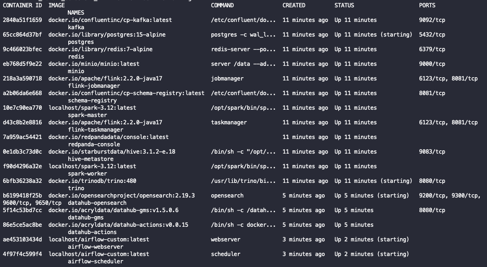

# Installation Guide

> This guide covers everything needed to get the EHR Lakehouse & Feature Store running from scratch on a machine without root access.

---

## Prerequisites

- Linux (x86-64)
- Python 3.12 (managed via `uv`)
- `uv` package manager — install with:
  ```bash
  curl -LsSf https://astral.sh/uv/install.sh | sh
  ```
---

## Step 1 — Install Rootless Podman

The entire stack runs inside Podman containers **without root**. If Podman is not installed on your system, use the bundled static installer:

```bash
make install-podman
```

This runs [`scripts/installation/install_podman_static.sh`](../scripts/installation/install_podman_static.sh), which:

1. Downloads a statically-linked Podman bundle from [`mgoltzsche/podman-static`](https://github.com/mgoltzsche/podman-static/releases/latest)
2. Installs `podman`, `crun`, `conmon`, `fuse-overlayfs`, `pasta`, `netavark`, and `rootlessport` to `~/bin/`
3. Writes custom rootless configuration files to:
   - `.tmp/config/containers/storage.conf` — uses `/var/tmp/$USER/fsds/storage` as the graph root (survives reboots)
   - `.tmp/config/containers/containers.conf` — sets `cgroupfs` manager and `crun` runtime
   - `.tmp/config/containers/policy.json` — permissive image pull policy
4. Copies the config files to `~/.config/containers/` for CLI convenience

---

## Step 2 — Configure Environment

```bash
cp .env.example .env
```

Edit `.env` to set any port overrides if the defaults conflict with your system. The most commonly adjusted variables are:

| Variable | Default | Notes |
|---|---|---|
| `POSTGRES_PORT` | `5432` | Standard Postgres port |
| `KAFKA_PORT` | `9092` | Kafka broker |
| `FLINK_REST_PORT` | `8087` | Flink REST / Dashboard UI |
| `DATAHUB_GMS_PORT` | `8088` | DataHub GMS API |
| `AIRFLOW_WEBSERVER_PORT` | `8082` | Airflow UI |
| `TRINO_PORT` | `8090` | Trino UI + SQL endpoint |
| `MINIO_PORT` / `MINIO_CONSOLE_PORT` | `9000` / `9001` | MinIO S3 API + Console |
| `DATAHUB_FRONTEND_PORT` | `9002` | DataHub UI |

**Check for port conflicts before starting anything:**
```bash
make check-ports
```

This runs [`scripts/misc/check_ports.py`](../scripts/misc/check_ports.py), which reads every `*_PORT` variable from `.env` and reports FREE / OCCUPIED status. All ports must be free before proceeding.

To automatically free any occupied ports (kills the occupying process):
```bash
make free-ports
```

---

## Step 3 — Download Flink Connector JARs

The Flink streaming processor requires the Kafka SQL connector JAR. This is downloaded automatically when you run `make up`, but you can also download it manually:

```bash
bash scripts/installation/download_jars.sh
```

This downloads:
```
flink-sql-connector-kafka-4.0.0-2.0.jar
```
to `.tmp/flink-lib/`, which is bind-mounted into the Flink job manager and task manager containers at `/opt/flink/lib/extra/`.

> [!IMPORTANT]
> The JAR must be present before starting the Flink containers. `make up` handles this automatically.

---

## Step 4 — Build Custom Images

Two services require custom-built images that cannot be built with `podman build` due to rootless layer snapshotting limitations. Both use a `run → exec → commit` approach instead.

### Custom Spark Image (Python 3.12)

```bash
make build-spark
```

Builds `localhost/spark-3.12:latest` by running the official Apache Spark base image, installing Python 3.12 inside it, and committing the result.

> **Run this once before `make up`.** The build takes 3–5 minutes.

### Custom Airflow Image

```bash
make build-airflow
```

Builds a custom Airflow image with the project's Python dependencies pre-installed.

> **Run this once before `make airflow-up`.** The build takes 5–10 minutes.

---

## Step 5 — Start the Stack

Start services in order:

```bash
# 1. Generate synthetic EHR data (no containers needed)
make generate

# 2. Core infrastructure: Kafka, Spark, Flink, Trino, MinIO, Postgres, Redis
make up

# 3. DataHub metadata platform (runs after core stack is healthy)
make datahub-up

# 4. Airflow orchestration (runs after core stack is healthy)
make airflow-up
```

> [!IMPORTANT]
> `make generate` must run **before** `make up` so that the Parquet data files exist when the Bronze ingest step runs.

`make up` performs the following:
1. Downloads Flink connector JARs (if not already present)
2. Starts all core containers via `podman-compose`
3. Waits for PostgreSQL to accept connections
4. Runs `scripts/misc/ensure_dbs.sh` to create all required databases and roles

`make datahub-up` additionally:
1. Runs metadata ingestion for all sources (postgres, kafka, hive, trino, minio)
2. Runs `datahub_enrich_metadata.py` to add documentation, owners, tags, and glossary terms

---

## Step 6 — Verify All Containers Are Running

```bash
make ps
```

You should see all containers with status `Up`:





| Container | Role |
|---|---|
| `kafka` | Message broker (KRaft mode) |
| `schema-registry` | Confluent Schema Registry |
| `redpanda-console` | Kafka UI |
| `postgres` | Airflow + Hive metastore DB |
| `redis` | Feast online store |
| `minio` | S3-compatible object storage |
| `hive-metastore` | Hive catalog for Trino |
| `trino` | SQL query engine |
| `spark-master` | Spark standalone master |
| `spark-worker` | Spark standalone worker |
| `flink-jobmanager` | Flink job manager |
| `flink-taskmanager` | Flink task manager |
| `datahub-gms` | DataHub metadata service |
| `datahub-frontend` | DataHub UI |
| `datahub-actions` | DataHub async actions |
| `opensearch` | DataHub search backend |
| `airflow-webserver` | Airflow UI |
| `airflow-scheduler` | Airflow DAG scheduler |

---

## Scripts Reference — `scripts/main/`

Brief description of every script in the main pipeline:

| Script | Run via | Description |
|---|---|---|
| [`1a_generate_offline_ehr.py`](../scripts/main/1a_generate_offline_ehr.py) | `make generate` | Generates synthetic EHR Parquet files (`patients`, `wards`, `event_metadata`, `visits`, `events`) with realistic data quality challenges (2% duplicates, skew, schema evolution, nulls). Output → `data/synthetic/` |
| [`1b_produce_stream.py`](../scripts/main/1b_produce_stream.py) | `make stream` | Publishes a continuous JSON stream of clinical events to the Kafka topic `patient-events`, simulating live bedside monitoring data with burst patterns, late arrivals (12%), and duplicate events (1.5%). |
| [`1.5_generate_eda_report.py`](../scripts/main/1.5_generate_eda_report.py) | `uv run scripts/main/1.5_generate_eda_report.py` | Generates an interactive Plotly HTML report and a Markdown report analysing the synthetic dataset: cardinality, skew, schema evolution, duplication rates, and streaming characteristics. Output → `data/eda_report.html` + `data/eda_report.md` |
| [`2a_ingest_to_bronze.py`](../scripts/main/2a_ingest_to_bronze.py) | `make ingest` | Reads Parquet files from `data/synthetic/` and writes them as Delta Lake tables to MinIO (`s3://lakehouse/topics/raw_*`). Registers tables in Trino under `delta.bronze`. Zero transformation — source fidelity preserved. |
| [`3_transform_to_silver.py`](../scripts/main/3_transform_to_silver.py) | `make transform` | PySpark job submitted to the Spark cluster. Reads Bronze tables, applies deduplication (event_id window dedup), type casting (timestamps, dates), null handling, and column standardisation. Writes to `delta.silver.stg_*`. |
| [`4_transform_to_gold.py`](../scripts/main/4_transform_to_gold.py) | `make golden` | PySpark job. Builds a conformed dimensional model from Silver: surrogate keys, dimension tables (`dim_patient`, `dim_ward`, `dim_event_type`, `dim_vital`, `dim_lab`, `dim_medication`, `dim_diagnosis`), fact tables (`fact_visit`, `fact_clinical_event`), and the One Big Table (`obt_clinical_events`). Applies Z-ordering on `patient_key`. |
| [`5_compute_features.py`](../scripts/main/5_compute_features.py) | `make features` | PySpark job. Reads `obt_clinical_events` and computes 6-month rolling patient feature aggregates: vitals stats, lab stats, ICD-10 chapter counts, medication counts, demographics, and training labels (`gold_visit_labels`). Writes to `delta.gold.feat_*`. |
| [`6_flink_stream_processor.py`](../scripts/main/6_flink_stream_processor.py) | `make flink-stream` | PyFlink DataStream job. Consumes `patient-events` Kafka topic, fans out to: (A) Delta Lake Bronze `raw_streams` archive; (B) 24h sliding window (15-min step) per-patient vital aggregates → `patient-features-24h` Kafka topic. Uses event-time watermarks. |
| [`7_feature_pipeline.py`](../scripts/main/7_feature_pipeline.py) | `make feature-pipeline` | Unified Feast orchestrator. Runs `feast apply` + full `feast materialize` on startup, then continuously consumes `patient-features-24h` Kafka topic and pushes to the Redis online store via `store.push()`. Also runs incremental materialisation on a refresh interval. |
| [`query_lakehouse.py`](../scripts/main/query_lakehouse.py) | `make query-lakehouse` | Queries all Bronze, Silver, and Gold tables via Trino. Validates row counts, schemas, deduplication, and derived column correctness. Prints a formatted summary table. |
| [`query_featurestore.py`](../scripts/main/query_featurestore.py) | `make query-featurestore` | Two modes: `--online` tests real-time feature retrieval from Redis via `get_online_features()`; `--export` builds point-in-time correct `train.parquet` + `test.parquet` for ML training via `get_historical_features()`. |

---

