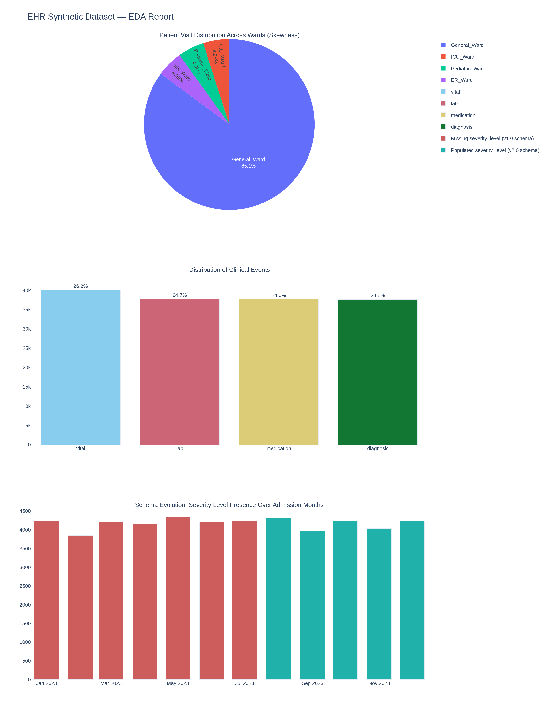

# Data Source: Synthetic EHR Dataset

## Overview

The pipeline is driven by a fully synthetic **Electronic Health Record (EHR)** dataset generated by `scripts/main/1a_generate_offline_ehr.py`. It models a mid-size hospital with ~1,000 patients, ~5,000 visits, and ~50,000 clinical events spanning multiple event types and time periods.

The data is intentionally representative of real-world clinical data characteristics — including sparse measurements, heterogeneous event types, temporal irregularity, and patient-level longitudinal structure — without containing any real patient information.

---

## Dataset Entities

### Patients

Represents the hospital's patient population.

| Field | Type | Description |
|---|---|---|
| `patient_id` | `VARCHAR` | Unique patient identifier (UUID-style) |
| `country` | `VARCHAR` | Country of origin |
| `gender` | `VARCHAR` | `M` / `F` |
| `dob` | `DATE` | Date of birth |
| `date_of_death` | `DATE` | Null if alive |
| `ethnic` | `VARCHAR` | Ethnicity category |

**Characteristics:**
- ~1,000 unique patients
- ~5% deceased at generation time
- Age distribution: 20–85 years (skewed toward older patients, reflecting hospital populations)
- Gender: ~50/50
- 7 nationality groups, 5 ethnicity categories

---

### Wards

Hospital ward reference table. Small, static dimension.

| Field | Type | Description |
|---|---|---|
| `ward_id` | `INT` | Surrogate key |
| `ward_name` | `VARCHAR` | Human-readable ward name |
| `department` | `VARCHAR` | Clinical department grouping |

**Characteristics:**
- ~20 wards across 5 departments (ICU, Cardiology, Oncology, General Medicine, Emergency)

---

### Event Metadata

Maps `event_type_id` to human-readable event descriptions. Acts as the controlled vocabulary for all clinical events.

| Field | Type | Description |
|---|---|---|
| `event_type_id` | `INT` | Surrogate key |
| `event_name` | `VARCHAR` | Human-readable name (e.g. `Heart Rate`) |
| `event_type` | `VARCHAR` | Category: `vital`, `lab`, `medication`, `diagnosis` |
| `unit_of_measurement` | `VARCHAR` | Units (e.g. `bpm`, `mg/dL`, `mmol/L`) |

**Event types covered:**

| Category | Events |
|---|---|
| **Vitals** | Heart Rate, Systolic BP, Diastolic BP, Temperature |
| **Labs** | Glucose, Creatinine, WBC, Hemoglobin |
| **Medications** | Lisinopril, Metformin, Amoxicillin, Atorvastatin |
| **Diagnoses** | Hypertension (I10), Diabetes (E11.9), URI (J06.9), Hyperlipidemia (E78.5) |

---

### Visits

One row per hospital admission/discharge event, linking patients to wards.

| Field | Type | Description |
|---|---|---|
| `visit_id` | `VARCHAR` | Unique visit identifier |
| `patient_id` | `VARCHAR` | FK → patients |
| `ward_id` | `INT` | FK → wards |
| `admission_timestamp` | `TIMESTAMP` | Admission date/time |
| `discharge_timestamp` | `TIMESTAMP` | Null if patient is still admitted |
| `severity_level` | `VARCHAR` | `LOW` / `MEDIUM` / `HIGH` / `CRITICAL` |

**Characteristics:**
- ~5,000 visits across ~1,000 patients (average 5 visits per patient)
- ~3% of visits are currently active (no discharge)
- Length-of-stay: 1–30 days (log-normal distribution)
- Severity distribution: 40% LOW, 35% MEDIUM, 20% HIGH, 5% CRITICAL

---

### Events

The core clinical events table. High-cardinality, sparse, heterogeneous.

| Field | Type | Description |
|---|---|---|
| `event_id` | `VARCHAR` | Unique event identifier |
| `visit_id` | `VARCHAR` | FK → visits |
| `patient_id` | `VARCHAR` | Denormalised FK for query performance |
| `event_timestamp` | `BIGINT` | Unix microseconds |
| `event_type_id` | `INT` | FK → event_metadata |
| `event_type` | `VARCHAR` | Category (denormalised) |
| `num_value` | `DOUBLE` | Numeric measurement (vitals, labs) |
| `text_value` | `VARCHAR` | Categorical value (medications, diagnoses) |

**Characteristics:**
- ~50,000 events across all visits
- Either `num_value` or `text_value` is populated (not both) — mimics real EHR sparsity
- Events are temporally ordered within each visit
- ~2% duplicate `event_id` values (realistic CDC artifact, resolved in Silver layer)
- Measurement frequency varies by event type: vitals every 1–4h, labs every 12–48h, diagnoses once per visit

---

## Real-Time Stream

`scripts/main/1b_produce_stream.py` publishes a continuous JSON stream of clinical events to the Kafka topic `patient-events`, simulating live monitoring data arriving from bedside devices.

Each message is a JSON object with the same schema as the batch events table, published at a configurable rate (default: 1 event/second).

The Flink processor (`scripts/main/6_flink_stream_processor.py`) consumes this stream and:
1. Archives raw events to Delta Lake (Bronze `raw_streams` table)
2. Computes 24-hour sliding window aggregates per patient per vital sign → `patient-features-24h` Kafka topic

---

## Data Quality Notes

| Issue | Layer resolved | Method |
|---|---|---|
| Duplicate `event_id` | Silver | Dedup by `event_id`, keep latest |
| Null `ward_id` in visits | Silver | Filter out records |
| Non-standard gender codes | Silver | Map to standard `M`/`F`/`Unknown` |
| Microsecond timestamps | Silver | Cast to standard `TIMESTAMP` |
| Mixed null/text in `text_value` | Gold | Coalesce with `num_value` per event type |
| Out-of-range vital measurements | Gold | Not filtered (left for ML preprocessing) |

---

## Data EDA

