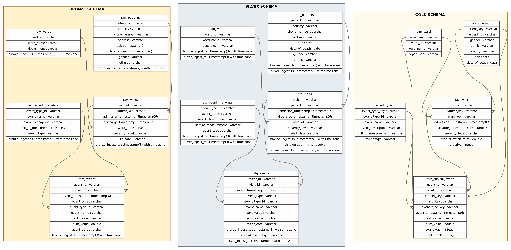

# Overall Data Design: Medallion Lakehouse

## Design Philosophy

The pipeline follows the **Medallion Architecture** (Bronze → Silver → Gold), a layered approach where each layer serves a distinct purpose and quality contract. All layers are stored as **Delta Lake** tables on **MinIO** (S3-compatible), queryable via **Trino** using the `delta` catalog.

```
Raw Files / Kafka
      │
      ▼
  BRONZE         Raw ingestion — no transformation, preserve source fidelity
      │
      ▼
  SILVER         Cleaned, deduplicated, typed — trusted analytical data
      │
      ▼
   GOLD          Conformed dimensional model + OBT — ready for BI and ML
      │
      ▼
 FEATURES        Pre-aggregated ML feature tables (Feast offline store)
```

All tables are stored at:
```
MinIO: s3://lakehouse/topics/<table_name>/
Trino: delta.<layer>.<table_name>
```

---

## Bronze Layer

### Purpose
Ingest raw source data with **zero transformation**. Preserve source fidelity — this is the single source of truth and the audit trail. Schema deviations, nulls, and duplicates are tolerated at this layer.

### Ingestion method
`scripts/main/2a_ingest_to_bronze.py` reads Parquet files from `data/synthetic/` and writes them as Delta Lake tables using Pandas + `delta-rs`.

### Tables

#### `delta.bronze.raw_patients`

| Column | Type | Description |
|---|---|---|
| `patient_id` | `VARCHAR` | Source patient identifier |
| `country` | `VARCHAR` | Country of origin |
| `gender` | `VARCHAR` | Raw gender code |
| `dob` | `VARCHAR` | Date of birth (raw string) |
| `date_of_death` | `VARCHAR` | May be null |
| `ethnic` | `VARCHAR` | Ethnicity category |

#### `delta.bronze.raw_wards`

| Column | Type | Description |
|---|---|---|
| `ward_id` | `INT` | Ward surrogate key |
| `ward_name` | `VARCHAR` | Ward name |
| `department` | `VARCHAR` | Department grouping |

#### `delta.bronze.raw_event_metadata`

| Column | Type | Description |
|---|---|---|
| `event_type_id` | `INT` | Event type key |
| `event_name` | `VARCHAR` | Human-readable event name |
| `event_type` | `VARCHAR` | Category: vital/lab/medication/diagnosis |
| `unit_of_measurement` | `VARCHAR` | May be null for medications/diagnoses |

#### `delta.bronze.raw_visits`

| Column | Type | Description |
|---|---|---|
| `visit_id` | `VARCHAR` | Visit identifier |
| `patient_id` | `VARCHAR` | FK → raw_patients |
| `ward_id` | `INT` | FK → raw_wards |
| `admission_timestamp` | `VARCHAR` | Raw timestamp string |
| `discharge_timestamp` | `VARCHAR` | Null if active |
| `severity_level` | `VARCHAR` | Raw severity label |

#### `delta.bronze.raw_events`

| Column | Type | Description |
|---|---|---|
| `event_id` | `VARCHAR` | Event identifier (may have duplicates) |
| `visit_id` | `VARCHAR` | FK → raw_visits |
| `patient_id` | `VARCHAR` | Denormalised FK |
| `event_timestamp` | `BIGINT` | Unix microseconds |
| `event_type_id` | `INT` | FK → raw_event_metadata |
| `event_type` | `VARCHAR` | Denormalised category |
| `num_value` | `DOUBLE` | Numeric measurement |
| `text_value` | `VARCHAR` | Categorical value |

### Quality constraints at Bronze

- **No filtering** — all rows from source are written as-is
- **No type coercion** — timestamps remain as strings/bigints
- Bronze acts as an **append-only** landing zone

---

## Stream Data Design

### Overview

Real-time clinical events arrive on the Kafka topic `patient-events` at `localhost:9092`. The **Flink unified processor** (`scripts/main/6_flink_stream_processor.py`) consumes this topic once and fans out to two sinks:

```
Kafka: patient-events
        │
        ├─── Sink A ──▶  Delta Lake: delta.bronze.raw_streams
        │                (raw event archive, Bronze layer)
        │
        └─── Sink B ──▶  Kafka: patient-features-24h
                         (SLIDE window 24h / step 15min, per patient per vital)
```

### Sink A: Raw stream archive (`raw_streams`)

Identical schema to `raw_events` (batch Bronze). All events written as they arrive, with an additional `_ingest_ts` watermark column.

### Sink B: Sliding window features (`patient-features-24h`)

The Flink job applies a **24-hour sliding window with 15-minute steps** per patient, computing rolling statistics for all numeric event types (vitals and labs).

**Output schema per Kafka message:**

| Field | Type | Description |
|---|---|---|
| `patient_id` | `STRING` | Patient identifier |
| `window_end` | `TIMESTAMP` | Window end time |
| `{vital}_mean` | `DOUBLE` | Mean over 24h window |
| `{vital}_min` | `DOUBLE` | Min over 24h window |
| `{vital}_max` | `DOUBLE` | Max over 24h window |
| `{vital}_std` | `DOUBLE` | Std dev over 24h window |

Vitals covered: `heart_rate`, `systolic_bp`, `diastolic_bp`, `temperature`, `glucose`, `creatinine`, `wbc`, `hemoglobin`

### Watermarking

The Flink job uses **event-time watermarks** based on `event_timestamp`, with a configurable lag (`WATERMARK_LAG_SECS`, default 5s) to handle out-of-order events from network jitter.

---

## Silver Layer

### Purpose
Produce **trusted, analytically clean** data. Apply deduplication, type coercion, null handling, and column standardisation. Silver is the foundation for all downstream modelling and feature engineering.

### Transformation script
`scripts/main/3_transform_to_silver.py` — PySpark job submitted to the Spark cluster.

### Tables

#### `delta.silver.stg_patients`

| Column | Type | Source | Transformation |
|---|---|---|---|
| `patient_id` | `VARCHAR` | `raw_patients` | Pass-through (validated non-null) |
| `gender` | `VARCHAR` | `raw_patients` | Mapped to `M`/`F`/`Unknown` |
| `ethnic` | `VARCHAR` | `raw_patients` | Trimmed, null-coalesced to `Unknown` |
| `country` | `VARCHAR` | `raw_patients` | Pass-through |
| `dob` | `DATE` | `raw_patients` | Cast from string to DATE |
| `date_of_death` | `DATE` | `raw_patients` | Cast from string to DATE, null preserved |

#### `delta.silver.stg_wards`

| Column | Type | Source | Transformation |
|---|---|---|---|
| `ward_id` | `INT` | `raw_wards` | Pass-through |
| `ward_name` | `VARCHAR` | `raw_wards` | Trimmed |
| `department` | `VARCHAR` | `raw_wards` | Trimmed, uppercased |

#### `delta.silver.stg_event_metadata`

| Column | Type | Source | Transformation |
|---|---|---|---|
| `event_type_id` | `INT` | `raw_event_metadata` | Pass-through |
| `event_name` | `VARCHAR` | `raw_event_metadata` | Trimmed |
| `event_type` | `VARCHAR` | `raw_event_metadata` | Lowercased |
| `unit_of_measurement` | `VARCHAR` | `raw_event_metadata` | Null preserved |

#### `delta.silver.stg_visits`

| Column | Type | Source | Transformation |
|---|---|---|---|
| `visit_id` | `VARCHAR` | `raw_visits` | Pass-through |
| `patient_id` | `VARCHAR` | `raw_visits` | Validated non-null |
| `ward_id` | `INT` | `raw_visits` | Null rows dropped |
| `admission_timestamp` | `TIMESTAMP` | `raw_visits` | Cast from string |
| `discharge_timestamp` | `TIMESTAMP` | `raw_visits` | Null preserved (active visit) |
| `severity_level` | `VARCHAR` | `raw_visits` | Uppercased |

#### `delta.silver.stg_events`

| Column | Type | Source | Transformation |
|---|---|---|---|
| `event_id` | `VARCHAR` | `raw_events` | Deduplicated (keep latest by `event_timestamp`) |
| `visit_id` | `VARCHAR` | `raw_events` | Pass-through |
| `patient_id` | `VARCHAR` | `raw_events` | Pass-through |
| `event_timestamp` | `TIMESTAMP` | `raw_events` | Cast from BIGINT microseconds |
| `event_type_id` | `INT` | `raw_events` | Pass-through |
| `event_type` | `VARCHAR` | `raw_events` | Lowercased |
| `num_value` | `DOUBLE` | `raw_events` | Pass-through |
| `text_value` | `VARCHAR` | `raw_events` | Trimmed |

---

## Gold Layer

### Purpose
Produce a **conformed dimensional model** for BI consumption and ML feature engineering. Gold applies business logic: surrogate keys, join-resolved denormalisation, derived columns (age, LOS), and the One Big Table (OBT).

### Transformation scripts
- `scripts/main/4_transform_to_gold.py` — PySpark job (dims, facts, OBT)

### Dimension Tables

#### `delta.gold.dim_patient`

| Column | Type | Description |
|---|---|---|
| `patient_key` | `BIGINT` | Surrogate key (monotonically increasing) |
| `patient_id` | `VARCHAR` | Natural key |
| `gender` | `VARCHAR` | Standardised gender |
| `ethnic` | `VARCHAR` | Ethnicity |
| `country` | `VARCHAR` | Country |
| `dob` | `DATE` | Date of birth |
| `date_of_death` | `DATE` | Null if alive |

#### `delta.gold.dim_ward`

| Column | Type | Description |
|---|---|---|
| `ward_key` | `BIGINT` | Surrogate key |
| `ward_id` | `INT` | Natural key |
| `ward_name` | `VARCHAR` | Ward name |
| `department` | `VARCHAR` | Department |

#### `delta.gold.dim_event_type`

| Column | Type | Description |
|---|---|---|
| `event_type_key` | `BIGINT` | Surrogate key |
| `event_type_id` | `INT` | Natural key |
| `event_name` | `VARCHAR` | Human-readable name |
| `event_type` | `VARCHAR` | Category |
| `unit_of_measurement` | `VARCHAR` | Units |

#### Typed Event Dimensions

Derived from `dim_event_type` + `stg_events` join. Each filters to a single event category and exposes the measurement value in a typed column.

| Table | Filter | Extra columns |
|---|---|---|
| `dim_vital` | `event_type = 'vital'` | `num_value`, `unit_of_measurement` |
| `dim_lab` | `event_type = 'lab'` | `num_value`, `unit_of_measurement` |
| `dim_medication` | `event_type = 'medication'` | `text_value` |
| `dim_diagnosis` | `event_type = 'diagnosis'` | `text_value` (ICD code in description) |

> **Note:** All four typed dimension tables (`dim_vital`, `dim_lab`, `dim_medication`, `dim_diagnosis`) are first-class Gold tables, tracked individually in DataHub lineage alongside `dim_patient`, `dim_ward`, and `dim_event_type`.

### Fact Tables

#### `delta.gold.fact_visit`

| Column | Type | Description |
|---|---|---|
| `visit_id` | `VARCHAR` | Natural key |
| `patient_key` | `BIGINT` | FK → dim_patient |
| `ward_key` | `BIGINT` | FK → dim_ward |
| `admission_timestamp` | `TIMESTAMP` | Admission time |
| `discharge_timestamp` | `TIMESTAMP` | Null if active |
| `severity_level` | `VARCHAR` | LOW/MEDIUM/HIGH/CRITICAL |
| `length_of_stay_hours` | `DOUBLE` | Derived: discharge − admission |
| `is_active` | `BOOLEAN` | True if no discharge |

#### `delta.gold.fact_clinical_event`

| Column | Type | Description |
|---|---|---|
| `event_id` | `VARCHAR` | Natural key |
| `visit_id` | `VARCHAR` | FK → fact_visit |
| `patient_key` | `BIGINT` | FK → dim_patient |
| `ward_key` | `BIGINT` | FK → dim_ward |
| `event_type_key` | `BIGINT` | FK → dim_event_type |
| `event_timestamp` | `TIMESTAMP` | Event time |
| `event_type` | `VARCHAR` | Category |
| `num_value` | `DOUBLE` | Numeric value |
| `text_value` | `VARCHAR` | Categorical value |

### One Big Table

#### `delta.gold.obt_clinical_events`

Denormalised join of `fact_clinical_event` with all dimension tables. Used as the primary source for feature engineering (`5_compute_features.py`).

All columns from `fact_clinical_event` + joined columns from:
- `dim_patient`: `gender`, `ethnic`, `country`, `dob`, `date_of_death`
- `dim_ward`: `ward_name`, `department`
- `dim_event_type`: `event_name`, `event_type`, `unit_of_measurement`

---

## Table Diagram

Entity-relationship diagram covering all Gold tables generated by `scripts/misc/render_er.py`:



---

## Key Design Decisions

| Decision | Rationale |
|---|---|
| Delta Lake over Parquet | ACID transactions, schema enforcement, time-travel for debugging |
| Surrogate keys in Gold | Decouples natural keys from analytical joins; enables SCD patterns |
| OBT alongside star schema | OBT simplifies ML feature queries; star schema serves BI/Trino |
| Microsecond timestamps in Bronze | Preserve source precision; cast to standard TIMESTAMP in Silver |
| Dedup in Silver, not Bronze | Bronze must be an exact copy of source for audit/replay |
