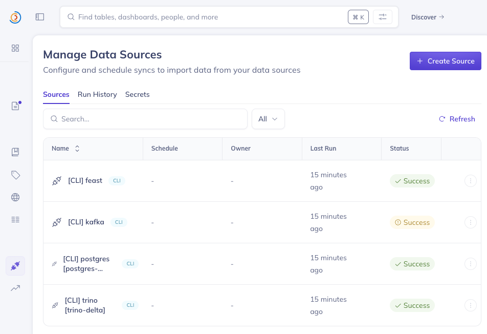
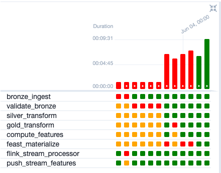
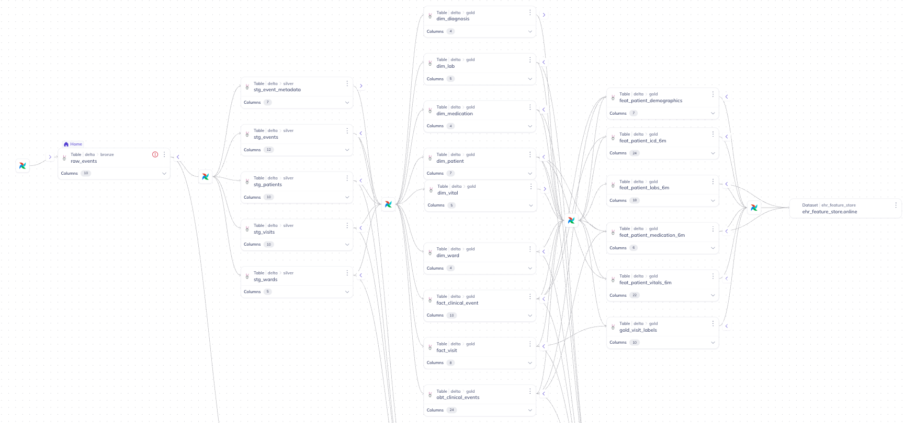
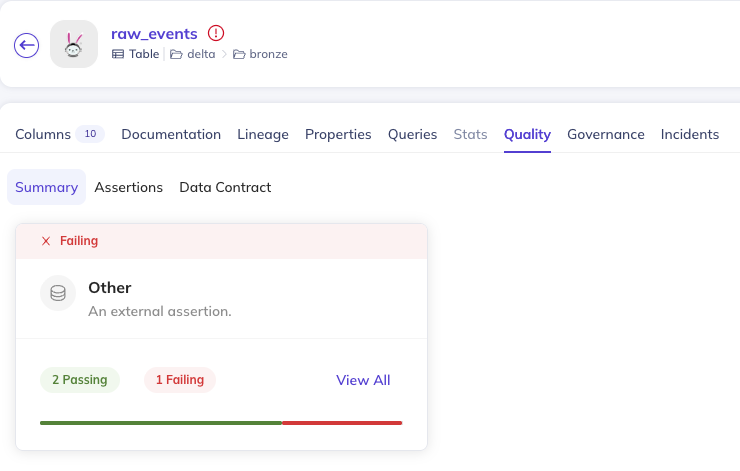
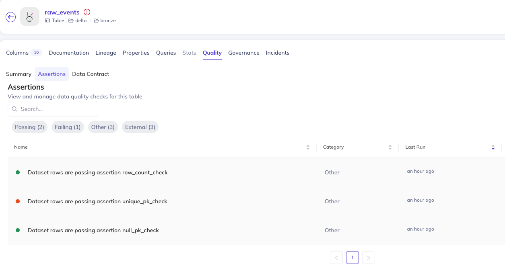
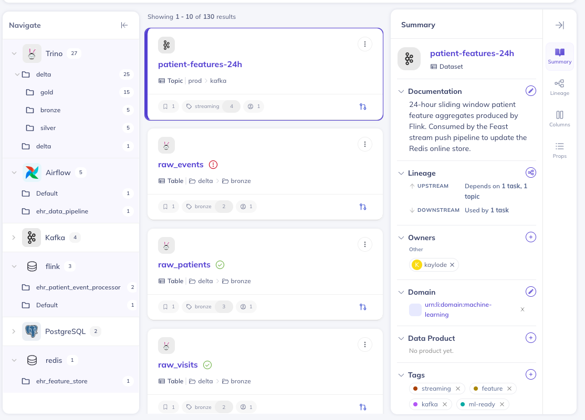

# Data Governance, Orchestration & Lineage

## Overview

Data governance and orchestration are handled by two complementary tools:

| Tool | Role |
|---|---|
| **Apache Airflow** | Pipeline scheduling, task dependency management, execution history |
| **DataHub** | Data catalogue, column-level lineage, quality assertions, metadata enrichment |

Together they provide full observability over the EHR pipeline — from raw data ingestion to ML-ready feature serving.

---

## Orchestration: Apache Airflow

**UI:** http://localhost:8082 (user: `airflow` / pass: `airflow`)

### DAGs

#### `ehr_data_pipeline` (daily)

The main batch pipeline DAG. Runs the full Bronze → Silver → Gold → Feature → Feast materialisation chain.

```
bronze_ingest
    │
    ▼
validate_bronze        ← quality gates: row count, null PK, duplicate PK
    │
    ▼
silver_transform
    │
    ▼
gold_transform
    │
    ▼
compute_features
    │
    ▼
feast_materialize       ← feast apply + feast materialize → Redis

flink_stream_processor  ─── (independent branch, runs in parallel)
    │
    ▼
push_stream_features    ← drains patient-features-24h → Redis
```

Each task emits **DataHub lineage events** (input/output dataset URNs) and records execution metadata to the `ehr_pipeline_runs` PostgreSQL table.

---

#### `datahub_metadata_ingestion` (every 5 min, configurable)

Crawls all data sources and pushes catalogue metadata to DataHub GMS.

| Task | Source crawled |
|---|---|
| `ingest_postgres` | Postgres schemas and tables |
| `ingest_kafka` | Kafka topics and Schema Registry |
| `ingest_hive_metastore` | Hive Metastore catalog (Delta table mappings for Trino) |
| `ingest_trino` | All Delta Lake tables via Trino `delta` catalog |
| `ingest_minio_lakehouse` | S3 paths under `s3://lakehouse/` |

> **Note:** The schedule can be changed in `config/orchestration/dags/datahub_ingestion.py` (`schedule_interval`). Default is `*/5 * * * *` (every 5 min) for development; change to `0 */6 * * *` for production.


**Registered data sources (postgres, kafka, hive, trino, minio):**



---


### Airflow DAG — Task Run History



---

## Data Governance: DataHub

**UI:** http://localhost:9002

DataHub provides the central data catalogue, automated lineage tracking, and manual metadata enrichment for the EHR pipeline.

---

### Lineage Graph

The lineage graph is automatically built by the `ehr_data_pipeline` DAG. Each task emits `DataFlow`, `DataJob`, and `UpstreamLineage` metadata change proposals (MCPs) via the DataHub REST emitter.

**Pipeline lineage graph (ehr_data_pipeline → feat_* → online store):**



**Batch lineage chain:**
```
Parquet files (file platform)
    │
    ▼ (bronze_ingest)
delta.bronze.raw_*
    │
    ▼ (silver_transform)
delta.silver.stg_*
    │
    ▼ (gold_transform)
delta.gold.dim_* / fact_* / obt_*
    │
    ▼ (compute_features)
delta.gold.feat_* / gold_visit_labels
    │
    ▼ (feast_materialize)
redis.ehr_feature_store.online
```

**Streaming lineage chain:**
```
kafka.patient-events
    │
    ▼ (flink_stream_processor)
kafka.patient-features-24h
    │
    ▼ (push_stream_features)
redis.ehr_feature_store.online
```

---

### Quality Assertions

The `validate_bronze` Airflow task runs three checks per Bronze table and emits results as DataHub **AssertionRunEvents**:

| Check | Description | Tables |
|---|---|---|
| `row_count_check` | Table has ≥ expected minimum rows | All 5 Bronze tables |
| `null_pk_check` | Primary key column has 0 null values | All 5 Bronze tables |
| `unique_pk_check` | Primary key column has 0 duplicate values | All except `raw_events` (duplicates expected) |

Assertion results are visible in DataHub under each dataset's **Assertions** tab.


| Data quality | Data assertion (failed example for unique key violation) | 
|---|---|
|  |  |

---

### Metadata Enrichment

Run `make datahub-enrich` to push rich metadata to DataHub for all tracked datasets. This is also run automatically as part of `make datahub-up`.

The enrichment script (`scripts/misc/datahub_enrich_metadata.py`) sets:

- **Documentation:** Human-readable description of each dataset's purpose, source, and layer
- **Ownership:** Assigned to `airflow` user (configurable)
- **Tags:** Layer (`bronze`, `silver`, `gold`, `feature`), domain (`ehr`, `pii`, `ml-ready`, `streaming`)
- **Glossary Terms:** Clinical vocabulary (`PatientIdentifier`, `ClinicalEvent`, `HospitalVisit`, `FeatureView`)
- **Domain:** `healthcare` or `machine-learning`
- **Custom Properties:** `layer`, `grain`, `feast_view`, `window`, `sla`


**Dataset schema view:**

---


